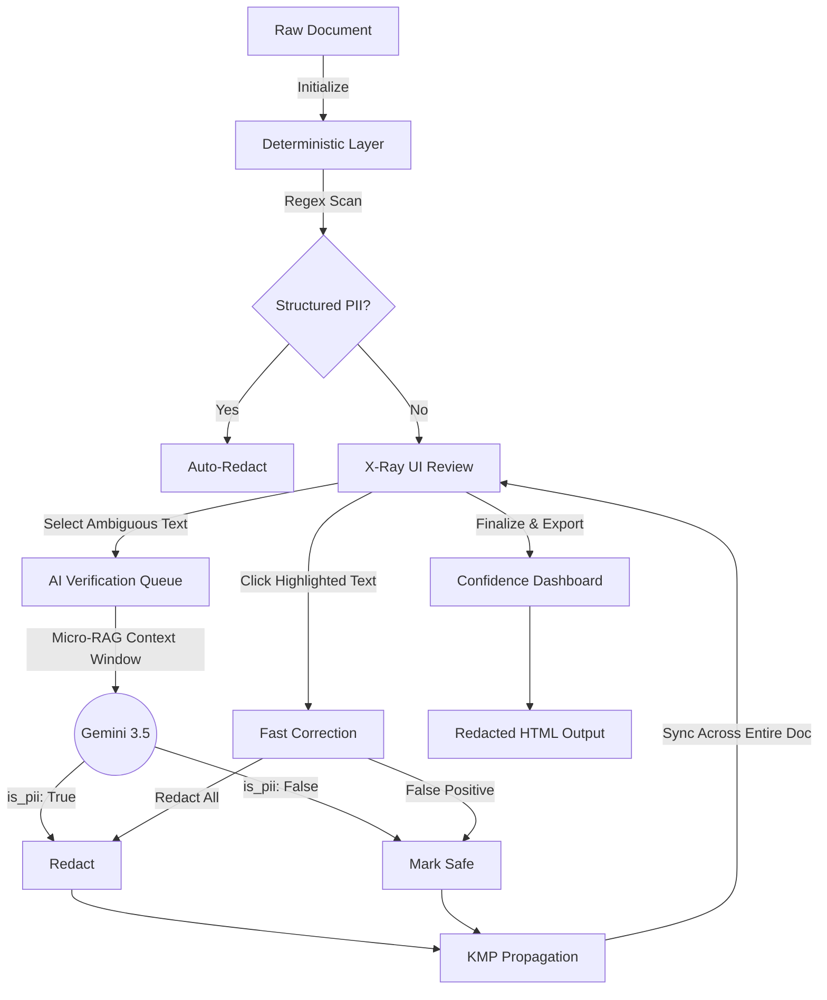

# Conseal Redaction Pipeline

**[Live Demo](https://sprintfour-hackathon.vercel.app/)** | **[Project Writeup & Reasoning (PDF)](./Conseal_%20Problem%203.pdf)**

> **Note:** The deployed page is an interactive mock demonstration of the final output phase of the redaction pipeline. It is pre-loaded with a dummy document to showcase the interactive verification and redaction workflow.

Conseal is an interactive, hybrid-intelligence document redaction platform designed to seamlessly protect Personally Identifiable Information (PII) without sacrificing document readability or operational performance.

---

## 📖 Table of Contents
- [The Challenge](#the-challenge)
- [Architecture & Workflow](#architecture--workflow)
- [Key Features & How to Use Them](#key-features--how-to-use-them)
- [Tech Stack](#tech-stack)
- [Getting Started](#getting-started)
- [Deployment](#deployment)

---

## 🎯 The Challenge

In industries handling massive volumes of sensitive documents—such as healthcare, legal, and finance—protecting PII is critical but fraught with operational hurdles. 

- **Regex-only approaches** excel at catching structured data (like phone numbers and emails) but fail at understanding context, leading to missed names or aggressive over-redaction of safe terms. 
- **Pure LLM approaches** (passing entire documents through models) are prohibitively slow, expensive, and prone to hallucinations. 

**The Solution:** Conseal engineers a multi-layered system that balances absolute precision, zero-latency execution, and the indispensable need for human oversight.

---

## 🔄 Architecture & Workflow

Conseal employs a "human-in-the-loop" architecture that isolates the strengths of different technologies.



---

## ✨ Key Features & How to Use Them

### 1. Deterministic Regex Scanning
The baseline layer for obvious, structured PII.
* **How to use:** Click the **"Run Regex Scanner"** button in the top right. 
* **What it does:** Instantly detects Phone Numbers, Emails, Social Security Numbers, IBANs, and IPv4 Addresses and marks them for redaction.

### 2. X-Ray Mode UI
A toggleable view that highlights detected PII in distinct colors based on their source and confidence, rather than obscuring them immediately.
* **How to use:** Toggle the **X-Ray / Plain** switch in the control panel.
* **What it does:** Allows the reviewer to actually see what is being removed before finalizing. Colors indicate the source (e.g., Pink = AI caught, Yellow = Regex caught).

### 3. Micro-RAG AI Verification
Instead of feeding the whole document to an LLM, Conseal uses Micro-Retrieval-Augmented Generation.
* **How to use:** Simply **highlight/select any text** in the document with your mouse and click **"Add to AI Queue"**. Then click **"Run AI Check"**.
* **What it does:** The backend extracts a tight 30-word context window around that term and sends it to Gemini 3.5 Flash. This reduces token usage/latency while providing pinpoint accurate classifications (e.g., differentiating "Apple" the company vs. "Apple" the person).

### 4. Interactive Correction & KMP Propagation
Instantly correct false positives or approve AI suggestions.
* **How to use:** **Click on any highlighted word** in the document to open a popover. Choose **"Mark Safe"** or **"Redact All"**.
* **What it does:** The backend uses the Knuth-Morris-Pratt (KMP) string matching algorithm to instantly find and synchronize your decision across **all** occurrences of that word in the entire document.

### 5. The Confidence Dashboard
Because the most dangerous mistakes are the ones users ignore, the application proves its value at the end of the workflow.
* **How to use:** Click the **"Finalize & Export"** button at the bottom of the screen.
* **What it does:** Presents a beautiful dashboard detailing exact session metrics: baseline AI catch rate, critical structured misses caught by the system, false positives corrected by the user, and a final composite system confidence score.

### 6. Styled Secure HTML Export
* **What it does:** Upon finalization, the system automatically downloads a `resume_john_doe_REDACTED.html` file. Un-safe PII is replaced by unselectable black blocks, while "Safe" words perfectly blend back into the plain text.

---

## 🛠 Tech Stack

- **Frontend:** Next.js (React), TailwindCSS, TypeScript
- **Backend:** FastAPI (Python), LangChain
- **AI Model:** Google Gemini 3.5 Flash
- **Algorithms:** Knuth-Morris-Pratt (KMP) string matching

---

## 🚀 Getting Started

### Prerequisites
- Node.js (v18+)
- Python (3.9+)
- A [Google Gemini API Key](https://aistudio.google.com/app/apikey)

### Backend Setup

1. Navigate to the backend directory:
   ```bash
   cd backend
   ```
2. Create and activate a virtual environment:
   ```bash
   python -m venv venv
   source venv/bin/activate
   ```
3. Install dependencies:
   ```bash
   pip install -r requirements.txt
   ```
4. Create a `.env` file in the `backend` directory and add your Gemini API key:
   ```env
   GEMINI_API_KEY=your_api_key_here
   ```
5. Start the FastAPI server:
   ```bash
   uvicorn main:app --reload --port 8000
   ```

### Frontend Setup

1. Open a new terminal and navigate to the frontend directory:
   ```bash
   cd frontend
   ```
2. Install dependencies:
   ```bash
   npm install
   ```
3. Start the Next.js development server:
   ```bash
   npm run dev
   ```
4. Open [http://localhost:3000](http://localhost:3000) in your browser to view the application.

---

## 🌍 Deployment

Conseal is pre-configured for modern cloud deployment.

### Deploying the Backend (Render)
1. Push your code to GitHub.
2. Connect your repository to [Render](https://render.com/) as a Web Service.
3. Build Command: `pip install -r requirements.txt`
4. Start Command: `uvicorn main:app --host 0.0.0.0 --port $PORT`
5. **Environment Variables**: Add your `GEMINI_API_KEY`.

### Deploying the Frontend (Vercel)
1. Import your GitHub repository into [Vercel](https://vercel.com/).
2. Set the Root Directory to `frontend`.
3. **Environment Variables**: Add `NEXT_PUBLIC_API_URL` pointing to your deployed Render backend URL (e.g., `https://your-backend.onrender.com`).
4. Click Deploy.
